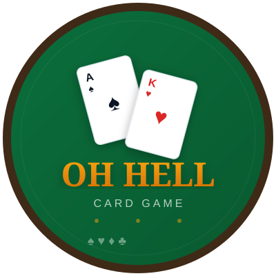

<p align="center">
  
</p>

<h1 align="center">Oh Hell Card Game</h1>

<p align="center">
  A multiplayer trick-taking card game built with .NET — playable on web and Android from a single shared codebase.
</p>

<p align="center">
  
  
  
  
</p>

---

## About the Game

**Oh Hell** (also known as Oh Pshaw or Bust) is a classic trick-taking card game for 3-6 players. The goal is simple: **bid how many tricks you'll win, then try to match your bid exactly.**

### Rules

1. **Deal** — Cards are dealt face-down. The number of cards per hand decreases each round (from a starting total back to 1, then back up), keeping the game dynamic
2. **Trump** — One card is flipped face-up to determine the trump suit for the round
3. **Bid** — Each player bids the number of tricks they expect to win (0 is allowed)
4. **Play** — Players must follow the lead suit. If you can't follow suit, play any card (trumps beat everything)
5. **Score** — Match your bid exactly to earn points (bid + 10 for a successful zero bid). Miss your bid and lose the difference

The player with the highest score after all rounds wins!

---

## Screenshots

<p align="center">
  
  &nbsp;&nbsp;
  
</p>

<p align="center">
  
  &nbsp;&nbsp;
  
</p>

> **Note:** Add your screenshots to the `screenshots/` folder in the repository.

---

## Features

- **Multiplayer** — Create rooms, share room codes, and play with friends in real-time via SignalR
- **Single Player** — Practice against 3 AI opponents with smart bidding strategy
- **Cross-Platform** — One codebase runs on both web browsers and Android devices
- **SVG Card Graphics** — Beautiful vector card artwork with multiple themes
- **Responsive Design** — Works on desktop, tablet, and mobile screens
- **Score Tracking** — Lifetime scores persist across sessions
- **Room System** — Create/join rooms with up to 6 players, shareable room links

---

## Tech Stack

| Layer | Technology |
|-------|-----------|
| **Game Engine** | C# / .NET 10 — Pure game logic with AI players |
| **Shared UI** | Blazor Razor Class Library — Single source of truth for all components |
| **Web App** | ASP.NET Core Blazor Server — Interactive Server rendering |
| **Android App** | .NET MAUI Blazor Hybrid — Native Android with WebView |
| **Real-time** | SignalR — Live multiplayer communication |
| **Styling** | CSS — Mobile-first responsive design |
| **Tests** | xUnit — 45 automated tests |

---

## Project Structure

```
cardgameonline/
├── OhHell.Core/              # Game engine (rules, AI, card logic)
├── OhHell.Components/        # Shared Blazor UI + services (used by both web & MAUI)
│   ├── Components/           # Razor components (Home, Layout)
│   ├── Services/             # GameSession, MultiplayerGameService, IPlatformStorage
│   ├── Models/               # OnlineGameRoom, OnlineRoomMember, etc.
│   └── wwwroot/              # CSS, SVG card assets, static files
├── OhHell.Web/               # Web host (ASP.NET Core + SignalR hub)
├── OhHell.Maui/              # Android app (.NET MAUI Blazor Hybrid)
├── OhHell.Tests/             # Unit + integration tests (45 tests)
└── logo.svg                  # Project logo
```

---

## Getting Started

### Prerequisites

- [.NET 10 SDK](https://dotnet.microsoft.com/download/dotnet/10.0)
- For Android: [.NET MAUI workload](https://learn.microsoft.com/dotnet/maui/) (`dotnet workload install maui`)

### Run the Web App

```bash
dotnet run --project OhHell.Web
```

Open `https://localhost:51200` in your browser.

### Run the Android App

```bash
dotnet build OhHell.Maui -t:Run -f net10.0-android
```

Or open the solution in Visual Studio and deploy to an Android emulator/device.

### Run Tests

```bash
dotnet test
```

---

## How to Play Online

1. Open the game in your browser (or Android app)
2. Enter your player name
3. Click **Create New Room** — you'll get a room code
4. Share the room code (or share link) with friends
5. Other players enter the code and click **Join**
6. The host clicks **Start Match** when everyone is ready

---

## AI Opponents

The game includes a built-in AI with position-aware bidding strategy:

- Analyzes hand strength using suit distribution and high card count
- Adjusts bids based on position (early vs late players)
- Considers round size — plays more conservatively in short rounds

---

## License

This project is open source. See the repository for license details.
