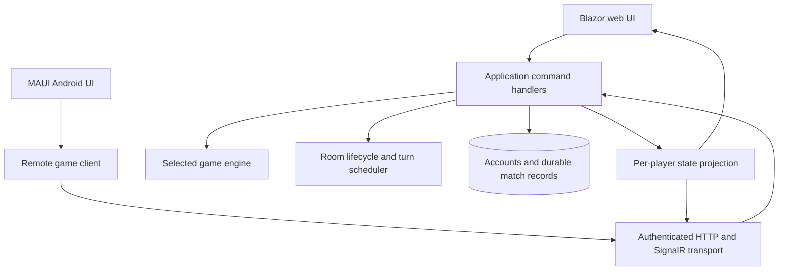

# CardGameOnline — Startup journey and executable backlog

Prepared 7 September 2026 for the founder and Hermes. UI reference updated 8 September 2026 from four founder-supplied screenshots.

Repository: https://github.com/Mfarsi138/cardgameonline

Reviewed commit: `c5b4825047e5ebb983239e142043cbe2d882b61b`.

This roadmap combines a read-only source inspection with the founder's Persian feature-list screenshot. No repository files were modified, dependencies installed, application launched, or tests executed. “Present” below means source exists, not that a feature is production-ready. The README's test-pass badge was not independently verified. Screenshot text is product input, not permission to deploy or contact users.

## 1. Product direction and the first decision

Working vision: a mobile-friendly social card-game service where people can quickly play a fair match, invite friends, learn the rules, and return for another game. Persian-speaking casual card players are an initial audience hypothesis inferred from the feature list; confirm it with the founder.

**Founder UI/UX direction:** substantially refactor the interface into a beautiful, polished card-game experience, using the colorful illustrated menus and sections shown in the four supplied reference screenshots. This is a V1 requirement, not optional V2 decoration. Section 12 and the detailed companion `../design/UI-BRIEF.md` translate these references into Oh Hell screens. A store link is no longer required to begin design; the product title is not independently verified.

**Decision D01 — confirmed by the founder: launch Oh Hell first; add Hokm later.** Preserve and finish the existing Oh Hell engine. Align rules, tutorial and branding around Oh Hell for V1. The screenshot wording includes “حکم روسی با قوانین عادی”; clarify terminology and variant details when planning later Hokm work. Do not replace the existing game. Hokm is a separate future expansion with its own approved rules.

Other founder decisions:

- D02: initial audience, language(s), and distribution market.
- D03: what “private room” means: unlisted link, invitation-only membership, or an additional access code. Default proposal is an unlisted, revocable invite.
- D04: preferred account method and whether phone verification can wait. SMS delivery is a separate external dependency; do not purchase it automatically.
- D05: Android launch channel and whether web-first private testing is acceptable. Proposed sequence: web alpha, Android internal beta, public release.
- D06: intended business model. Test willingness to pay for cosmetics later; do not assume payments, betting, or prizes are part of this product.

## 2. What the code already provides

Evidence links are pinned to the reviewed commit so future changes do not alter this assessment.

| Area | Observed implementation | Implication |
| --- | --- | --- |
| Game rules | C# Oh Hell engine, bidding, legal-card selection, scoring and AI turns | Preserve and test this engine; Hokm needs its own approved rules |
| Web | .NET 10 Blazor Interactive Server, scoped GameSession, singleton multiplayer service | Keep .NET/Blazor; avoid a framework rewrite |
| Android | .NET MAUI Blazor Hybrid project | Android is started, but online cross-device behavior is not established |
| Multiplayer | In-memory rooms, member lists, host/start/join logic, room updates and bot filling | Useful prototype; needs authoritative identity, lifecycle and transport work |
| Public browsing | Active-room summaries returned by GetActiveRooms | Existing foundation; no private/public visibility flag found in reviewed room flow |
| Turn timeouts | 15-second timers and automatic bid/card actions | Partial implementation; timeout action is not persistent bot takeover |
| Rejoin | Stored browser player ID and room reconnect state | Convenience identity is not authenticated proof of ownership |
| History | Lifetime-score dictionary and browser storage; engine event log | Not durable per-user match history |
| Presentation | Shared Razor UI, board/card theme properties, SVG assets and responsive CSS | Reuse assets; avoid recreating themes as a wholly new feature |
| Tests | xUnit engine/service, HTTP/static-asset, and mobile-source checks | Not evidence of real Android-to-web multiplayer or complete match reliability |

Primary evidence:

- [Engine and scoring](https://github.com/Mfarsi138/cardgameonline/blob/c5b4825047e5ebb983239e142043cbe2d882b61b/OhHell.Core/GameEngine.cs)
- [Web composition](https://github.com/Mfarsi138/cardgameonline/blob/c5b4825047e5ebb983239e142043cbe2d882b61b/OhHell.Web/Program.cs)
- [Multiplayer service](https://github.com/Mfarsi138/cardgameonline/blob/c5b4825047e5ebb983239e142043cbe2d882b61b/OhHell.Components/Services/MultiplayerGameService.cs)
- [Session and local/online orchestration](https://github.com/Mfarsi138/cardgameonline/blob/c5b4825047e5ebb983239e142043cbe2d882b61b/OhHell.Components/Services/GameSession.cs)
- [Lobby hub](https://github.com/Mfarsi138/cardgameonline/blob/c5b4825047e5ebb983239e142043cbe2d882b61b/OhHell.Web/Hubs/GameLobbyHub.cs)
- [Android service registration](https://github.com/Mfarsi138/cardgameonline/blob/c5b4825047e5ebb983239e142043cbe2d882b61b/OhHell.Maui/MauiProgram.cs)
- [Shared screen](https://github.com/Mfarsi138/cardgameonline/blob/c5b4825047e5ebb983239e142043cbe2d882b61b/OhHell.Components/Components/Pages/Home.razor)
- [Tests](https://github.com/Mfarsi138/cardgameonline/tree/c5b4825047e5ebb983239e142043cbe2d882b61b/OhHell.Tests)

### Launch-critical observations

1. **Android networking gap:** MauiProgram registers a local MultiplayerGameService, while GameSession calls that service directly. The reviewed hub exposes create/join but not the complete match-command/event surface. Add a remote client path before claiming Android and web share a match. Do not send the full engine with every player's hand to clients.
2. **Timer interference:** PlaceBidAsync and PlayCardAsync cancel a room timer before checking that the caller owns the active turn. Invalid actions can therefore affect the timer through this service path. Add regression tests and move cancellation after validated acceptance; verify every public entry point.
3. **Round authorization:** AdvanceRoundAsync accepts sessionId but does not validate membership before advancing. Enforce the approved actor policy server-side and test outsider requests.
4. **Timeout race:** a delayed timer callback can observe a newer turn; tie deadlines to match/turn revision and verify exactly one accepted move.
5. **State durability:** rooms live in a ConcurrentDictionary. A process restart loses them. Define interruption behavior for alpha, then add recoverable match state or an explicit cancellation/restart policy before promising continuity.
6. **Rules mismatch:** README describes a different scoring outcome from the engine, whose ApplyRoundScores uses `exactBid ? 10 + bid : player.TricksWon`. Obtain rules approval and align tests, tutorial and README.
7. **Maintenance size:** Home.razor is about 1,018 lines. Split it by coherent UI responsibility while retaining behavior and test coverage.

These are source-level findings, not exploit demonstrations or a full security audit.

## 3. Player journey

| Step | Player experience | Product work | Measure |
| --- | --- | --- | --- |
| Discover | Understand which game this is and why to try it | Clear Persian/selected-language landing page and rules preview | Landing-to-play-start rate |
| Try | Start as an unnamed guest without registration | Generated guest identity and practice with bots | Time to first legal card |
| Learn | Learn trump, turn order and winning conditions while playing | Short guided tutorial for the chosen game | Tutorial completion and help requests |
| Connect | Create a private table and share its link | Invites, capacity feedback, reconnect | Invite-open to successful-join rate |
| Find a game | Browse public tables or join a simple queue | Visibility filters and rule/player-count matching | Queue wait and match-start rate |
| Finish | Play a fair match despite brief disconnects | Validated turns, deadlines, bot handover and resume | Started-to-completed match rate |
| Return | See result/history and invite the same friends | Profile upgrade, history, friends and rematch | Players returning within seven days |
| Progress | Earn fair progress and customize appearance | V2 XP, levels, leagues and themes | Returning play without farming/abuse |

Primary validation question: **Will small groups complete a match and choose to play again without founder assistance?**

## 4. Map of every screenshot item

Original version numbers are preserved. Stages below refine delivery order; they do not silently delete requirements. The label interpreted as “لای عمومی برای گشتن به دنبال بازی مولتی پلیر” is treated as a public lobby. Daily/weekly challenges and push notifications are normalized from the screenshot's abbreviated labels.

| ID | Original feature | Original version | Current source status | Planned task |
| --- | --- | --- | --- | --- |
| F01 | تغییر معماری مناسب — architecture improvement | 1 | Layered projects exist; shared service/transport boundaries need work | A02–A04 |
| F02 | اپلیکیشن اندروید — Android app | 1 | MAUI project exists; online transport incomplete | A04, V114 |
| F03 | حکم روسی با قوانین عادی — rules/game variant wording in screenshot | 1 | Founder confirmed Oh Hell first; Hokm later | V101; future X01–X03 |
| F04 | محدودیت زمانی هر نوبت و جانشین شدن Bot | 1 | Timer and one-move autoplay exist; takeover/reclaim incomplete | A03, V105 |
| F05 | BOT | 1 | Oh Hell AI exists; difficulty parameter not used by reviewed CreateRoom body | V104 |
| F06 | امکان ساختن اتاق اختصاصی و ارسال دعوتنامه Share | 1 | Room creation and link sharing exist; privacy incomplete | V106 |
| F07 | لابی عمومی برای گشتن به دنبال بازی مولتی پلیر | 1 | Room summaries exist | V107 |
| F08 | جور کردن بازیکن‌ها براساس اولویت‌هایی مثل تعداد بازیکن در بازی | 1 | No queue/policy implementation found in reviewed source | V108 |
| F09 | ارسال ایموجی، پیام از پیش معلوم | 1 | Not found in reviewed source | V112 |
| F10 | پروفایل کاربر، ثبت نام با شماره موبایل | 1 | Browser identity exists; verified account flow not found | V109 |
| F11 | بازی به صورت مهمان بدون انتخاب اسم و ثبت تاریخچه | 1 | Name-required multiplayer UI; generated guest flow incomplete | V102 |
| F12 | ثبت تاریخچه | 1 | Aggregate local scores/event log only | V110 |
| F13 | اضافه کردن افراد به فهرست دوستان | 1 | Not found in reviewed source | V111 |
| F14 | دعوت دوستان | 1 | Room links exist; account-friend invitations missing | V111 |
| F15 | آموزش بازی | 1 | Basic bidding hints exist; guided tutorial absent | V103 |
| F16 | گرفتن XP | 2 | Not found in reviewed source | V201 |
| F17 | Leveling | 2 | Not found in reviewed source | V202 |
| F18 | لیگ | 2 | Not found in reviewed source | V203 |
| F19 | تورنمنت‌ها | 2 | Not found in reviewed source | V204 |
| F20 | چالش‌های روزانه و هفتگی | 2 | Not found in reviewed source | V205 |
| F21 | تم‌های متفاوت | 2 | Theme foundation already exists | V206 |
| F22 | Push notification | 2 | Not found in reviewed source | V207 |

F11 is interpreted as guest play without required name or persistent personal history; F12 provides history for registered users. Confirm whether guest history should be retained temporarily and merged on signup. Guest play must not require phone verification.

## 5. Architecture to grow from the existing code

Keep a **modular .NET application**, initially on one game-server instance. Keep the existing pure engine and shared Blazor components. Add clear contracts and server authority, not microservices.



Recommended boundaries:

- Core: cards, deterministic rule validation, scoring and bot strategy; no networking or database calls. Add separate rules implementation for another game only after D01.
- Application: player-bound commands, room ownership, action sequencing, reconnect and deadline policy. Online commands contain match ID, action ID and expected revision.
- Contracts: validated commands and per-player snapshots. Reveal only the requesting player's hand, public table state and permitted result information.
- Infrastructure: persistence, identity, real-time delivery and time abstraction. Choose one small relational database; SQLite is a candidate for a single-instance test, with PostgreSQL an option when operational needs justify it. Record the choice before adding migrations.
- UI: split Home into lobby, room, table, hand, bid control, scoreboard, tutorial and profile components. Inject a narrow client/application interface instead of exposing mutable OnlineGameRoom/Engine to remote clients.

Do not put startup agents in the real-time game path. Game bots should use tested local C# strategies; free LLM quotas must not decide whether a player's turn completes.

For the existing 2-vCPU/3.7-GiB server, run one agent job at a time. Avoid Android SDK/emulator builds there; use a suitable development machine or an explicitly approved build runner. Keep gameplay tests separate from heavy agent builds. Production capacity is unknown until load tests measure concurrent rooms, active circuits, memory and latency. Do not promise a player count from RAM alone.

## 6. Milestones and launch gates

Dates are planning ranges, not delivery promises. Re-estimate after A01 and the first tested change; free-model quotas and Android tooling can stretch them.

| Stage | Indicative effort window | Outcome | Exit gate |
| --- | --- | --- | --- |
| S0 — Establish baseline | 2–4 focused workdays | Rules decision, repeatable tests, prioritized defects | A01 and D01 resolved; existing behavior recorded |
| S1 — Reliable web alpha | 1–2 focused weeks | One selected game, guests, bots, safe turns, private room | A03 and essential V1 game tasks pass; five scripted matches finish |
| S2 — Friends and Android beta | 2–3 focused weeks | Shared Android/web matches, public lobby, history and invites | Three browser players plus one Android client can finish an applicable four-player match; reconnect works |
| S3 — Complete V1 and validate | 1–2 focused weeks | Remaining V1 social/account features and tested operations | V1 acceptance checks pass; founder approves public release |
| S4 — Retention experiments | After observed repeat use | V2 progression and cosmetics | Build features in measured batches, not all at once |

Use 10–20 invited testers as an initial proposed cohort, recruited by the founder. Proposed private-beta gates: at least 20 completed human-involved matches, no unresolved critical rules/identity/private-card defects, and at least 90% completion of started matches in that small cohort. Report raw counts beside percentages. These are internal acceptance targets, not industry benchmarks.

## 7. Executable task backlog

All tasks start unchecked. P0 = blocks reliable play; P1 = V1 delivery; P2 = V2. Hermes owns specifications, OpenCode owns implementation, a fresh sequential reviewer session checks evidence, and the founder owns product decisions and release approval. Every implementation task must link its branch/PR, relevant tests and result.

### Foundation

- [ ] **A01 · P0 · Baseline and rules inventory** — Owner: Hermes + reviewer. Dependencies: none. Inspect current HEAD; record SDK/package versions; run `dotnet test OhHell.Tests/OhHell.Tests.csproj` and web build in an appropriate environment; record failures accurately. Inventory actual rules versus README. Pin floating test package versions and SDK in a small reviewed change if appropriate. Acceptance: reproducible commands, real test results, D01 options and scoring discrepancies recorded. Do not invoke the entire MAUI solution just to test web.
- [ ] **A02 · P1 · Define boundaries and split the large page** — Owner: builder. Depends: A01. Introduce application/client contracts and extract coherent UI components incrementally. Acceptance: existing web flows remain equivalent; no business rules added to display components; no wholesale framework rewrite.
- [ ] **A03 · P0 · Repair online action authority and timers** — Owner: builder. Depends: A01. Validate caller/phase/card before mutating timer state; authorize round advancement; revision-check timeouts; make duplicate actions idempotent; define host departure and cleanup. Acceptance: outsider, wrong-turn, duplicate, simultaneous timeout/move and stale-callback tests pass; exactly one move advances the turn.
- [ ] **A04 · P0 for Android · Shared online transport** — Owner: builder. Depends: A02, A03. Implement remote command/event surface and a MAUI client; derive player identity server-side; project private state. Acceptance: separate devices share one authoritative match; raw responses never include opponents' hidden cards; reconnect cannot claim another identity; no in-device singleton used as the online authority.
- [ ] **A05 · P1 · Persistence, operational checks and release pipeline** — Owner: builder/reviewer. Depends: A01, A03. Add chosen schema/migrations, health reporting, structured errors and bounded room cleanup. Add web test/build automation and documented backup/restore. Acceptance: results survive restart, restore works in isolation, active-match interruption policy is visible, and a failed build cannot deploy. Android pipeline is separate.

### Version 1

- [ ] **V101 · P0 · Finalize Oh Hell rules for launch** — Depends: A01; D01 is resolved. Preserve the engine. Founder approves the exact scoring variant and resolves the README/code mismatch before changing scoring. Document dealing, bidding restrictions, trump, legal moves, scoring, victory and supported player counts. Acceptance: deterministic examples and complete seeded matches pass; help text matches implementation; unsupported player counts rejected. Hokm is excluded from this V1 task.
- [ ] **V102 · P1 · One-tap guest play** — Depends: A03. Issue server-bound guest identity and generated display name, with no phone/name form required. Acceptance: new browser reaches a legal practice turn; guest cannot impersonate another player; account conversion/history policy is documented.
- [ ] **V103 · P1 · Short guided tutorial** — Depends: V101, V102, D02. Explain only the selected game through a short playable example; provide skip/replay. Acceptance: a new tester can finish the tutorial and identify a legal move; Persian/RTL behavior checked if selected.
- [ ] **V104 · P0 · Reliable bots** — Depends: V101. Reuse current C# AI; make difficulty selection real or remove the misleading control. Acceptance: bots never make illegal bids/cards in seeded scenarios; finish matches; use no LLM API; don't access opponents' private hands to choose moves.
- [ ] **V105 · P0 · Timeout, bot substitution and reclaim** — Depends: A03, V104. Specify missed-turn threshold, disconnected-seat policy, reconnect grace and safe human takeover point. Acceptance: absent player cannot stall a match; reconnect does not permit two controllers; stale timers do nothing; remaining time comes from server deadline.
- [ ] **V106 · P1 · Truly private rooms and share invites** — Depends: A03, V102, D03. Extend existing room links with explicit visibility and invite policy. Acceptance: private rooms absent from public listing/queue; invalid/expired/full invites produce useful errors; shared link opens the correct room; unauthorized users cannot read room state.
- [ ] **V107 · P1 · Public lobby** — Depends: V106. Extend active-room listing with game type, player count, capacity and joinability. Acceptance: only public joinable rooms shown; full/started changes handled atomically; stale/empty rooms cleaned up; private room identifiers not leaked.
- [ ] **V108 · P1 · Simple matchmaking** — Depends: V101, V107. Match by game variant and allowed player count first; add skill criteria only when supported by real player volume. Acceptance: one queue entry per identity; cancellation/timeout work; one seat assigned atomically; bots only fill according to a visible policy; incompatible rules never mix.
- [ ] **V109 · P1 · Profile and mobile signup** — Depends: V102, A05, D04. Add verified account ownership and guest upgrade, then phone OTP through an approved provider or a clearly labeled development fake. Acceptance: fake OTP impossible in production; codes expire and attempts are limited; account recovery and number-change behavior specified. Real SMS remains blocked if no provider/budget is approved; do not claim feature complete.
- [ ] **V110 · P1 · Match history** — Depends: A05, V101; account history also V109. Save server-issued match/result IDs and participant summaries. Acceptance: completed match saved once despite retries; scores cannot be uploaded as trusted browser totals; account sees only permitted records; selected guest policy honored.
- [ ] **V111 · P1 · Friends and friend invitations** — Depends: V106, V109. Add request/accept/remove/block and in-app invite lifecycle. Acceptance: blocked users cannot invite; duplicates suppressed; invite resolves room access and capacity safely; existing share links continue to work without friendship.
- [ ] **V112 · P1 · Emoji and preset messages** — Depends: A03 and online transport used by each client. Use a controlled message set with per-user limits and mute. Acceptance: no arbitrary HTML, no cross-room delivery, disconnected clients cannot spam, selected language renders correctly.
- [ ] **V113 · P1 · Instrument the player journey** — Depends: V102, V106. Track minimal events for tutorial, join, start, completion, disconnect, timeout and return. Acceptance: event IDs avoid double counting; no phone numbers or hidden cards in analytics; report completion and invite conversion with raw counts.
- [ ] **V114 · P1 · Android internal beta** — Depends: A04, V101, V105, V106. Configure actual server endpoint, lifecycle/reconnect and invite opening. Acceptance: signed internal build installs on a real device; Android/web cross-play, background/resume, rotation and poor-network tests recorded; signing keys kept out of Git.
- [ ] **V115 · P1 · Founder-led V1 validation and release** — Depends: V1 tasks or explicitly documented scope exceptions. Recruit initial testers, collect completion/return feedback, verify backup and rollback, confirm assets/license provenance and basic privacy/support information. Acceptance: founder approves concrete build and release checklist; release notes truthfully identify unavailable features. Do not contact testers or publish without authorization.

### Version 2

- [ ] **V201 · P2 · XP** — Depends: V110, V113, validated V1. Server awards bounded XP once per eligible match; bot-farming policy defined. Acceptance: replayed result cannot earn XP twice; abandoned/invalid matches handled consistently.
- [ ] **V202 · P2 · Levels** — Depends: V201. Version a clear XP-to-level table. Acceptance: boundary tests pass; progress reconciles across devices; level does not give hidden card advantages.
- [ ] **V203 · P2 · Leagues** — Depends: V108, V110, V201. Define rating, seasons, eligibility and disconnect policy; separate it from cosmetic XP. Acceptance: deterministic ranking updates, season rollover and ties tested; sufficient active players demonstrated before splitting queues.
- [ ] **V204 · P2 · Tournaments** — Depends: V203, reliable V105. Start with one small supported bracket format. Acceptance: registration cap, scheduling, no-shows, disconnects, ties and duplicate results produce a consistent bracket; no paid prizes introduced implicitly.
- [ ] **V205 · P2 · Daily/weekly challenges** — Depends: V201. Use server-time windows and idempotent rewards. Acceptance: refresh/reconnect/time-zone changes cannot double-claim; objectives remain achievable for casual users.
- [ ] **V206 · P2 · Expand themes** — Depends: V1 UX review. Reuse board/card theme infrastructure; add accessible selection and persistence. Acceptance: card readability across themes and Android/web checked; theme changes do not change rules or reveal cards. Cosmetic monetization is a separate founder decision.
- [ ] **V207 · P2 · Push notifications** — Depends: V111, V114, D05. Add opt-in notifications for relevant invites/events with quiet hours and deep links. Acceptance: denial of permission does not break play; logout/token rotation stops delivery; duplicates suppressed; sender costs approved before paid usage.

## 8. First ten tasks Hermes should execute

1. Refresh repository HEAD and read applicable repository instructions; preserve uncommitted work.
2. Create `docs/startup/STATUS.md`, `DECISIONS.md` and a task board from this document. Record D01 as resolved: Oh Hell first, Hokm later. Include UX01–UX08 from Section 12 in V1. Prepare the UX screen map and design direction before broad page refactoring. Ask about unresolved scoring details only when they affect a change.
3. Perform A01 and record actual baseline results.
4. Reproduce timer cancellation by an invalid actor with a regression test.
5. Fix and review that narrow A03 defect.
6. Test and repair round-advance authority as another small change.
7. Test stale timeout/duplicate-action handling and define disconnect policy.
8. Write the A02/A04 contract proposal with private-state projection and Android wiring.
9. Implement the smallest guest/private-room web vertical slice supported by current rules.
10. Demonstrate a complete match and record defects before expanding the queue.

These are execution slices, not ten autonomous parallel agents. Split larger backlog entries into similarly small changes.

## 9. Hermes and Paperclip execution instructions

You are working on **CardGameOnline**, an existing .NET card game. This document replaces the earlier generic landing-page demonstration as the product brief. Do not create an unrelated startup or replace the repository with a new template.

Use Hermes for planning and task bookkeeping, OpenCode for focused code changes, and a fresh sequential session for review. Use Paperclip if installed and verified. If its installation is still blocked, maintain Markdown task records and continue repository work; record that orchestration is incomplete. Agent infrastructure setup must not consume the entire product effort.

Preserve `openrouter/free` and zero-spending policy. Verify the selected free model can use the necessary tools. Free-router availability/quality may vary; checkpoint work before retries. Never send production credentials, OTPs, customer data or hidden game state to models. Game bots themselves run in C#.

One active agent job at a time on the current test server. Use isolated Git branches/worktrees; inspect `git status` first. Each task needs acceptance criteria, dependency IDs and test evidence. A model saying “done” is not sufficient. Do not merge, publicly deploy, send invitations, purchase SMS, or add paid services without founder authorization. Continue reversible local work without repeated approval questions.

Suggested task record, an internal convention rather than an assumed Paperclip API schema:

```yaml
id: A03-01
title: Invalid move must not cancel the active turn timer
status: ready
depends_on: [A01]
owner: builder
reviewer: separate-review-session
model_policy: verified-free-only
repository: https://github.com/Mfarsi138/cardgameonline
acceptance:
  - Wrong-player request is rejected
  - Original valid turn deadline remains active
  - Exactly one legal move or timeout advances the turn
evidence: []
```

Map statuses to the installed orchestrator: proposed → ready → running → review → done, with blocked and a specific reason. Do not mark a milestone complete while required device tests or account services remain unavailable.

## 10. Founder business work alongside development

- Interview 5–8 potential players about their current game, who they play with, invitation friction and disconnect frustrations. The founder sends invitations; Hermes may draft questions and summarize supplied notes.
- Test the chosen game identity before investing in a second rule set.
- Watch early testers without coaching every action. Record confusing turns and reasons they abandon a match.
- Ask players whether they voluntarily invited a friend and played again. Gather evidence before building leagues and tournaments.
- Explore cosmetics or another explicit offer only after useful repeat play. Keep gameplay fair and separate monetization decisions from technical implementation.
- Review a weekly digest: completed matches, unique players, failed joins, return counts, top defects, model quota interruptions, and the next three tasks.

## Definition of success

The first success is a small group completing a reliable match in the selected game and choosing to return. V1 success adds the founder's full requested social/mobile experience with honest scope reporting. V2 should deepen an already useful experience, with each feature justified by player behavior.

## 11. Later expansion: Hokm

- [ ] **X01 · Future · Hokm rules specification** — Depends: stable Oh Hell V1 and founder scheduling approval. Confirm variant, teams, player count, dealing, trump selection, scoring, disconnect and bot policies. Acceptance: approved worked examples and explicit differences from Oh Hell.
- [ ] **X02 · Future · Separate Hokm engine and bots** — Depends: X01 and core boundaries. Reuse card/UI infrastructure without changing Oh Hell behavior. Acceptance: complete seeded Hokm matches and Oh Hell regression tests pass.
- [ ] **X03 · Future · Hokm lobby, tutorial and cross-play** — Depends: X02, A04. Add game selection and game-specific queues/rooms. Acceptance: users never join incompatible rules; web and Android complete a Hokm match; Oh Hell remains available.

Hokm is a later expansion, not automatically part of the screenshot's V2 progression release. Schedule it based on founder priorities and player evidence.

## 12. V1 UI/UX redesign — a polished card-game experience

### Design intent and reference status

The founder supplied four visual references on 8 September 2026: a play/progression screen, artifact collection, character collection, and shop. These images establish the intended menu style. Observed patterns include saturated colors, thick dark outlines, beveled golden buttons, raised active bottom tabs, illustrated panels, category tabs and framed collections. Motion, responsiveness and hidden interactions cannot be verified from still screenshots.

Use the supplied screenshots for visual hierarchy and section composition. Apply original card-game illustrations and branding. Reinterpret character collections as appearance collections and the main Fight action as Play Oh Hell. Preserve normal playing-card semantics; a cosmetics collection is not a deck-building mechanic. Do not infer approval for ads, purchases, energy gates or random reward systems from their presence in a reference image.

The updated direction is **a colorful illustrated card-game club**: royal-blue/purple scenery, golden dimensional controls, warm framed panels, expressive original avatars and bold readable headings. The actual match table uses quieter emerald felt and ivory cards for readability. This supersedes the earlier restrained luxury-card-room proposal. Keep one dominant Play action and a strong visual identity across distinct sections.

### Information architecture

Outside a match, propose five illustrated bottom tabs: **Collection, Friends, Play, Journey, Profile**, with Play raised at the center. Play is the home/entry destination, avoiding a duplicate Home section. Collection initially exposes real existing appearance choices; Journey initially contains the tutorial and practice milestones, not invented XP. Keep unavailable sections out of the shipped shell until their minimal useful content works. On desktop, preserve hierarchy with an adapted rail/header. Put settings/help in consistent secondary access and preserve section state.

Inside a match, remove the global navigation from the primary play area. Keep only table controls, score/rules access, sound/settings and deliberate leave behavior. Returning from a settings sheet must not leave the match.

| Screen/section | V1 purpose and hierarchy | Later expansion |
| --- | --- | --- |
| Home | Player/guest identity; one dominant Play button; Play with friends; practice/tutorial; contextual resume-match panel | Real league/event preview once implemented |
| Play hub | Quick play, private room, public tables, practice; clear Oh Hell label | Hokm selector only after its engine ships |
| Public tables | Human-readable occupancy, room/rules summary and join action; filters secondary | More advanced matching filters when player volume permits |
| Create private table | Essential options first, then invite/share; sensible defaults; clarify human/bot seats | Additional supported game variants |
| Waiting room | Seats/avatars, human/bot labels, room visibility, copy/share, host start and readiness policy | Optional cosmetics |
| Game table | Legible hand, visible trump, current turn/deadline, bids/tricks, played cards and contextual legal action | Cosmetic-only table themes |
| Round result | What happened, score delta and clear next step; inspect score without losing context | Progress summary after server-side XP exists |
| Match result | Placement, comprehensible scoring, rematch, invite again and exit | XP/level rewards when supported |
| Friends | Online/in-game status if supported, invitations, empty-state help, block/remove | Notification preferences integrated later |
| Profile/history | Identity, account upgrade, completed results, appearance/settings | Levels, leagues and cosmetic collection |
| Tutorial/help | Playable intro, rules, scoring examples and contextual help | Separate Hokm tutorial |

Do not populate V1 with fake currencies, reward counters, league ranks or nonfunctional event buttons. Advanced navigation means clear hierarchy and useful sections. Future features belong in the design system and roadmap; show a “coming later” item only when it helps explain a real user question.

### Original visual system proposal

- Palette: royal blue `#30478D`, purple `#7850BA`, gold `#FFC52E`, warm frame `#A9682C`, cyan `#36B8DF`, dark outline `#302519`, table emerald `#124D3D`, card ivory `#FFF8E9`. These are proposed tokens inspired by the screenshots, not measured samples. Validate text/background contrast before finalizing.
- Surfaces: subtle table texture and lighting; layered panels with restrained edges/shadows; avoid blur-heavy or constantly animated backgrounds on the test server/mobile devices.
- Typography: one licensed, highly legible Persian-capable family if Persian is selected, with a compatible Latin treatment. Establish clear title/body/metadata sizes and tabular scoring numerals. Bundle needed font files; do not assume an external font service is reachable.
- Icons: one consistent vector style; supplement important icons with labels. Sound, mute, invite, exit and rules must be recognizable.
- Cards: generous rank/suit corners, crisp scalable artwork, visible selected/legal/disabled states. Suit meaning must not rely on color alone. Keep the existing SVG assets where they meet the design; audit provenance and rendering before replacement.
- Avatars: consistent frames and seat labels; distinguish humans, bots, current player and disconnected players without requiring animation.
- Motion: brief deal/select/play/result transitions, generally around 150–300 ms for controls; longer dealing is skippable or interruptible by new authoritative state. Avoid delaying an online turn for decorative animation. Offer reduced-motion and independent sound controls.
- Components: buttons, sheets, tabs, room row, avatar/seat, status banner, card, hand, countdown, bid picker, scoreboard, toast, empty state and error state share tokens and interaction rules.

### Match UX that must work before release

1. A player can identify their hand, current turn, trump, bid, tricks won and remaining time at a glance.
2. Selecting a card provides a clear preview/selection state; choose a deliberate tap-to-play or select-then-confirm policy through testing. Prevent rapid repeated taps from sending duplicate moves.
3. Illegal cards have a visible state and an understandable explanation. Local affordances assist the player; the server remains the authority.
4. Bidding highlights permitted values and explains excluded bids. Touch targets remain usable without covering essential table information.
5. Countdown uses the server deadline. Warn near expiry without flashing or relying only on red. Network loss is shown separately from a player's timeout.
6. A reconnect banner says what is happening and whether a bot is temporarily controlling the seat. Do not show a success toast before the server accepts the action.
7. Round and match results explain score changes according to the approved Oh Hell rules. Provide clear Rematch and Back to lobby actions.
8. Leaving an active match has a concise consequence message and deliberate confirmation; this is a player-facing game action, not an agent permission flow.
9. Empty/full/expired/private room and service-unavailable states each explain the next useful action. Guest signup prompts never interrupt a live turn.

### Responsive, Persian and accessibility behavior

Design mobile first, then verify desktop and Android WebView. Test representative 360×800, 390×844, 768×1024 and 1440×900 layouts, plus mobile landscape and enlarged text. These are test targets, not promises of device coverage.

Use touch areas of at least 44×44 CSS pixels as a design target. Check text contrast, visible keyboard focus, accessible control names, keyboard play for web, and screen-reader announcements for meaningful turn/result changes. Never announce every countdown tick. Check safe-area insets, Android back behavior and accidental edge gestures.

If Persian is selected, mirror navigation and text layout intentionally, isolate Latin room codes/IDs, and verify mixed numerals. Do not automatically reverse seat order or clockwise game progression because the UI is RTL; define table direction explicitly from game rules.

### UI/UX tasks and dependencies

- [ ] **UX01 · P1 · Current UI audit and reference map** — Owner: Hermes/design role. Depends: A01. Reference input is ready: use the four supplied screenshots and companion UI brief. Run the existing UI if possible and capture actual home, room, table, bid and result screens. Produce `docs/design/UI-AUDIT.md` with usability issues, observed reference patterns and the screen map. Acceptance: current product screenshots, reference images and new proposals are clearly distinguished; core workflows and error states are covered. Do not ask for the reference again.
- [ ] **UX02 · P1 · Original visual direction and tokens** — Depends: UX01. Produce a coherent high-fidelity proposal for Home, Waiting room and Game table at mobile and desktop sizes, plus reusable tokens/components. Use an interactive prototype or rendered mockups that the founder can actually inspect; text adjectives alone are insufficient. Acceptance: readable real card examples, hierarchy and selected/error states shown; all assets have provenance. Obtain founder feedback on this concrete design before applying it across the entire product.
- [ ] **UX03 · P1 · Navigation shell and Play hub** — Depends: UX02, A02. Implement the proposed Collection/Friends/Play/Journey/Profile shell incrementally, including contextual resume and guest actions. Acceptance: center Play is easy to find; real appearance selection and tutorial give Collection/Journey useful V1 content; existing routes remain reachable; browser/Android back behaves sensibly; no dead sections are presented as working.
- [ ] **UX04 · P1 · Lobby, invitation and waiting-room experience** — Depends: UX03, V106, V107. Apply the design to public tables, room creation, share and player seats. Acceptance: guest can open an invite and understand the next action; host can tell who is ready and which seats are bots; full/private/expired cases are usable on mobile.
- [ ] **UX05 · P0 usability · Game table, cards and bidding refactor** — Depends: UX02, A02, A03, V101. Implement readable responsive table, legal-card cues, bidding, trump, authoritative countdown and reconnect states. Acceptance: complete a match on narrow mobile without essential controls colliding; keyboard/touch selection works; repeated taps do not duplicate commands; no hidden opponent cards rendered in remote clients.
- [ ] **UX06 · P1 · Results, tutorial, profile and history** — Depends: UX03, V103, V110; account features also V109. Deliver clear score explanation and rematch, visual onboarding and account/history screens. Acceptance: UI matches implemented rules and real stored data; no mock XP shown as earned progress.
- [ ] **UX07 · P1 · Motion, audio and interface polish** — Depends: UX04–UX06. Add deliberate transitions, feedback and settings with reduced-motion support. Acceptance: no layout shift that moves a card under the finger; queued animation never blocks a valid turn; audio can be muted and follows platform activation rules; assess actual performance on a modest device.
- [ ] **UX08 · P1 · Visual regression and usability gate** — Depends: UX04–UX07, V114 for Android-specific evidence. Capture the agreed screens/states in browser and on an actual Android build; test mixed RTL/LTR, focus, enlarged text, reconnect and empty/error states. Acceptance: founder reviews real screenshots/prototype, major usability defects resolved, and at least five target testers can start/join/play without continuous coaching. Report raw outcomes rather than inventing a usability score.

### Updated milestone requirements

- S0 adds UX01 and an inspectable UX02 proposal alongside the baseline. Reliability fixes may continue while visual feedback is pending.
- S1 requires the redesigned Play entry, waiting-room essentials and game table (UX03–UX05), with functional dependencies met for the alpha slice.
- S2 adds polished social/history/Android screens and device verification; don't wait until after beta to discover layout problems.
- S3 / V115 now also depends on UX08. Record any unsupported screen/device checks as pending; do not describe an unrendered implementation as visually verified.
- V2 progression, events and themes must extend the same navigation and component system rather than introduce a competing menu layout.

### Instructions for Hermes applying this update

Treat UI/UX as a product workstream integrated with the existing backlog. Start by inspecting actual screens and preparing an original visual proposal. Use a design role sequentially under the same one-agent concurrency limit; no new agent framework is required. Split the large page incrementally after a screen/component map exists. Keep Oh Hell rules and tests intact.

The four supplied screenshots are sufficient to begin reference-based design. Follow `../design/UI-BRIEF.md` for observed patterns, screen adaptations and mockup requirements. The exact store title remains unverified but is not a blocker. Do not claim still images verify animation or usability. Do not publish the redesign or purchase art/fonts/services without the existing required authorization.
